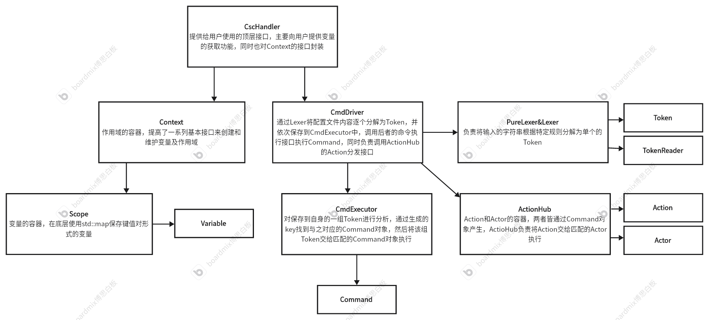

# 1.简介

libcsc是使用C++实现的一个工具库，用于解析后缀为`.csc`(Command-Style Configuration)的配置文件。


# 2.csc文件语法

csc文件的语法十分简单，在当前版本中，csc文件由两部分组成：作用域(Scope)和变量(Variable)。以下是一个csc文件*sample.csc*的示例：

```
name = "CSC Sample"
version = "0.6.8"

;This is a scope
Dummy::
	switch = true
	factor = 1.15
	maxCount = 255
	minCount = 0xF0
	users = {"Tom", "Jerry", "Emily"}

	Bar::
		content = "Anyting"
	::Bar
::Dummy
```

在该文件中，形如`name = "CSC Sample"`声明了一个变量，`name`是变量名称，`"CSC Sample"`是变量值，csc文件支持以下类型的变量：

* 布尔值：true、false
* 整型：255、0xFF
* 浮点型：1.15
* 字符串："CSC Sample"
* 数组：{"A", "B", "C"}、{1, 2, 3}

对于数组而言，其中的所有元素都应该是相同的类型。当字符串中需要出现引号`"`这类特殊字符时，可以使用`\`进行转义。

然后，`Dummy::`声明了一个作用域，`Dummy`是作用域名称，不同作用域内的同名变量相互独立，如果在同一个作用域内声明相同的变量，那么后者将覆盖前者。作用域内允许声明另一个作用域，就像`Bar::`一样。在作用域中完成所有变量的声明后，需要使用`::Dummy`和`::Bar`表示退出该作用域。在本例中，像`name = "CSC Sample"`这类没有声明于用户定义的作用域内的变量，将默认处于根作用域中。

csc文件支持注释，注释以分号`;`开始，在分号之后的内容都被视为注释内容而被忽略。


# 3.使用方式

## 3.1.编译

(本例以Win10、MinGW作为编译环境，请确保已安装CMake和make)

libcsc使用CMake作为构建系统，为了不破坏项目原有结构，本例以源外构建为例。假设libcsc项目位于*D:\File\libcsc*，我们先于同级目录创建一个*build*目录，即*D:\File\build*，随后进入build目录，执行：

```shell
cmake -G "Unix Makefiles" ../libcsc
```

待生成Makefile文件后，执行`make`。在编译成功后，可以在*build/bin/static*目录下找到编译后的静态库。如果需要编译动态链接库，则在执行cmake命令时添加如下参数：

```shell
cmake -DBUILD_SHARED_LIBS=YES -G "Unix Makefiles" ../libcsc
```

然后同样是执行`make`。编译后在*build/bin/dll*目录下可找到动态链接库。


## 3.2.使用

以解析sample.csc为例，让我们编写如下程序，并保存为*main.cpp*：

```C++
#include <iostream>
#include <fstream>
#include "csc/core/CscHandler.hpp"

using csc::String;
using csc::CscHandler;

int main(void){
    //使用标准库函数读入文件内容到字符串
	std::ifstream ifs("sample.csc");
    String str((std::istreambuf_iterator<char>(ifs)), std::istreambuf_iterator<char>());
    
    //创建CscHandler对象，解析文件内容
    CscHandler handler(str);
    handler.enter("/");      //进入根作用域
    std::cout << "name: " << handler.getValue<String>("name") << std::endl;     //获取name变量值
    handler.enter("/Dummy"); //进入根目录下的Scope作用域
    std::cout << "Dummy.switch: " << handler.getValue<bool>("switch") << std::endl;//获取Dummy::switch
    
    //也可以使用enterAndGet函数直接获取变量值
	std::cout << handler.enterAndGet<bool>("/Dummy/switch") << std::endl; //路径的最后一部分将被视为变量名称
}
```

假设*main.cpp*所在项目结构如下：

```
/
---include
------csc
---lib
------libcsc.a
---src
------main.cpp
------sample.csc
```

其中，include目录下包含了libcsc的所有头文件。我们进入src，然后执行如下命令编译main.cpp：

```shell
g++ -I ../include -L ../lib -o main main.cpp -lcsc
```

最后执行编译得到的main.exe即可。


# 4.API文档

## 4.1.用户使用的API

以下内容将对**csc/core**下的用户API进行详细说明：

### CscHandler

CscHandler可用于解析csc文件内容并获取其中的变量值，用户需要将保存有csc文件内容的字符串作为构造函数参数交给CscHandler进行解析。CscHandler亦可用于创建csc文件的内容，用户通过默认构造函数创建一个空的CscHandler，然后通过editor函数获取到编辑器对象，随后就可根据自身需要创建作用域及相应的变量，最后调用toString函数获取结果。

```C++
CscHandler()
    默认构造函数，创建一个带有根作用域的空CscHandler对象，通常结合editor函数和toString函数来创建csc文件的内容
CscHandler(crString script)
    按csc语法解析script中的内容到CscHandler对象中
bool accessible(crString path, bool v=false)
    检查给定的路径是否存在，默认将path视为作用域路径，当v为true时，将path视为变量路径
String absolutePath()
    获取从根作用域到当前作用域的绝对路径
CscHandler& enter(crString path)
    进入path对应的作用域，当path为"/"时，进入根作用域
CscHandler& iterate(ContextSeeker &seeker)
    按DFS算法迭代当前作用域的所有变量以及其中的子作用域，用户需要提供一个ContextSeeker的派生类对象
String toString()
    从当前作用域开始，将其中的所有内容字符串化后返回。如果需要从根作用域字符串化，请先调用enter("/")进入根作用域
CscEditor editor()
    返回一个CscEditor对象，可用于编辑CscHandler中的内容
Tp getValue<Tp>(crString name)
    获取当前作用域下指定名称的变量值，需要指定该变量值所需转换的类型
Tp enterAndGet<Tp>(crString path)
    获取指定路径下的变量值，需要指定该变量值所需转换的类型
```

### CscEditor

CscEditor提供了对CscHandler内容的编辑功能。

```C++
CscEditor& autoEnterOn()
	开启autoEnter功能，当使用makeScope函数创建作用域后，自动进入该作用域而无需调用enterScope函数
CscEditor& autoEnterOff()
	关闭autoEnter功能
CscEditor& makeScope(crString name)
	在当前作用域下创建一个指定名称的作用域
CscEditor& enterScope(crString name)
	进入当前作用域下指定名称的子作用域
CscEditor& leaveScope()
	离开当前作用域，回到它的父作用域。当位于根作用域时，调用此函数将引发异常
CscEditor& cleanScope(crString name)
	清除当前作用域下指定名称的作用域
CscEditor& makeVariable(crString name, ValueType type, T &&...values)
	在当前作用域中创建指定名称的变量，type指定变量的类型，values是一组指定变量值的可变参数，请确保其都为同一类型
    当创建一个已存在的变量时，将会直接使用values替代该变量中的变量值
CscEditor& extendValues(crString name, T &&...values)
	追加当前作用域中指定名称的变量的变量值
CscEditor& cleanVariable(crString name)
	清除当前作用域中指定名称的变量
```

### ContextSeeker

ContextSeeker定义了用于迭代CscHandler内容的相关接口。用户可参考*csc/core/CscStrSeeker*实现自己的迭代功能：

```C++
void enterScope(UID id, crString name)
    当进入一个作用域时，将调用此函数。id是作用域的唯一标识，name是作用域的名称
void leaveScope(UID id, crString name)
    当离开一个作用域时，将调用此函数。id是作用域的唯一标识，name是作用域的名称
void values(crString name, const ValueAccessor &accessor)
    当获取到该作用域中的一个变量时，将调用此函数。name是变量名称，values是变量值列表
```


## 4.2.支持类型

getValue和enterAndGet函数支持如下类型：

```C++
bool
int
long
double
String      等同于std::string
ArrBool     等同于std::vector<bool>
ArrInt      等同于std::vector<int>
ArrLong     等同于std::vector<long>
ArrDouble   等同于std::vector<double>
ArrString   等同于std::vector<std::string>
```


## 4.3.扩展功能

libcsc通过action模块提供了在Command对象之外操作Context的能力，该模块可用于实现那些仅依靠Command对象无法实现的功能，例如生成Scope和Variable的索引。下方是使用ActionHub模块为libcsc增加的扩展功能的列举：

### 索引生成

**基本信息**

* 引入版本：v0.6.1
* 关键字：`action`
* 作用域：Scoped(仅在当前作用域内有效)
* 使用方式：`action "genidx"`
* 作用：在当前Scope内创建两个strings类型的内置变量`_vidx_`和`_sidx_`，然后从插入位置开始，将后续添加进当前Scope的变量和下一级Scope的名称分别添加到`_vidx_`和`_sidx_`中

**使用方式**

在csc文件内插入

```
custom::
	action "genidx"
	
	name = "Tom"
	age = 18
	
	sub1::
	::sub1
	
	sub2::
	::sub2
::custom
```

在经过CscHandler解析后，等同于以下内容

```
custom::
	_vidx_ = {"name", "age"}
	_sidx_ = {"sub1", "sub2"}
	
	name = "Tom"
	age = 18
	
	sub1::
	::sub1
	
	sub2::
	::sub2
::custom
```


# 5.项目结构

## 5.1.目录结构

* include：存放libcsc中使用到的头文件
* doc: 存放libcsc文档使用到的相关资源
* src：存放libcsc的源码文件
* README.md：项目的介绍以及使用方式
* Releaselogs.md：项目的发布信息、版本信息、特性


## 5.2.详细说明

**整体架构图**



